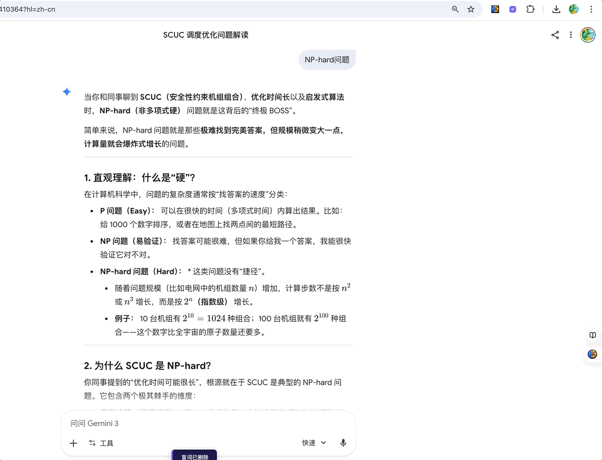

# 盲词管理浏览器插件

核心定位：帮用户收集、管理浏览网页时遇到的不理解、需学习的词语（盲词），打造个人专属学习清单。

## 核心功能

1. 盲词添加：选中网页文本右键「添加至盲词」，或在插件面板手动输入添加，自动记录词语、来源、时间等信息。
2. 盲词面板：点击插件图标弹出右侧面板，展示所有盲词，支持勾选切换「待处理/已处理」状态（已处理词语置灰划线）。
3. 盲词管理：支持关键词搜索、状态筛选（全部/待处理/已处理），可单条/批量删除、编辑盲词及备注。
4. 导出功能：可选择导出全部/待处理/已处理盲词为 Excel 文件，包含完整关联信息。
5. 存储同步：默认本地存储，支持 Chrome 配置同步，多设备登录同一 Google 账号可同步数据。

## 安装方法

- **下载** `blind-word-extension.zip`，解压到本地文件夹
- 打开 Chrome，地址栏输入 `chrome://extensions/`
- 右上角开启 **「开发者模式」**
- 点击 **「加载已解压的扩展程序」** ，选择解压后的 `blind-word-extension` 文件夹
- 安装完成，工具栏会出现紫色图标 🟣，选中浏览器文本右键可选择「添加至盲词」

